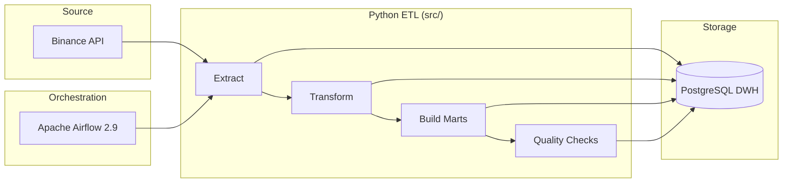

# Crypto Market Data DE

ETL-пайплайн для сбора часовых свечей (klines) криптовалют с Binance, загрузки в PostgreSQL DWH и построения аналитических витрин. Оркестрация — Apache Airflow.

## Описание проекта

Проект решает задачу регулярного обновления рыночных данных по криптовалютам и подготовки их для аналитики.

**Источник данных:** публичный REST API Binance (`/api/v3/klines`)

**Целевые монеты:** BTC, ETH, SOL (настраивается через `.env`)

**Интервал:** 1 час

**Результат:** слой raw → fact → marts в PostgreSQL, плюс автоматические quality checks после каждого прогона.

Пайплайн поддерживает инкрементальную загрузку: при повторном запуске забираются только новые свечи после последнего `open_time` в БД.

---

## Архитектура



### Слои данных

| Слой | Таблица | Назначение |
|------|---------|------------|
| Raw | `raw_klines` | Сырые OHLCV-свечи с биржи |
| Fact | `fact_price_ohlcv` | Нормализованные данные + `price_change`, `price_change_pct` |
| Mart | `mart_coin_hourly` | Агрегированная почасовая витрина |
| Mart | `mart_top_movers` | Топ движений цены с рангом по `price_change_pct` |
| Meta | `pipeline_runs` | История запусков пайплайна (статус, метрики) |

### Airflow DAG

DAG `crypto_market_pipeline` запускается каждый час (`@hourly`):

```
extract_raw → transform_fact → build_marts → quality_checks
```

---

## Стек

| Категория | Технологии |
|-----------|------------|
| Язык | Python 3.12 |
| Оркестрация | Apache Airflow 2.9 (LocalExecutor) |
| База данных | PostgreSQL 15 |
| HTTP-клиент | `requests` |
| DB-драйвер | `psycopg2-binary` |
| Конфигурация | `python-dotenv` |
| Контейнеризация | Docker, Docker Compose |

---

## Структура проекта

```
CryptoMarketDataDE/
├── dags/
│   └── crypto_pipeline.py      # Airflow DAG
├── src/
│   ├── config.py               # Настройки из .env
│   ├── db.py                   # Подключение к PostgreSQL
│   ├── extract.py              # Запросы к Binance API
│   ├── transform.py            # Загрузка fact-слоя
│   ├── marts.py                # Построение витрин
│   ├── quality.py              # Data quality checks
│   ├── state.py                # Инкрементальное состояние (last open_time)
│   ├── sql_loader.py           # Загрузка SQL из файлов
│   ├── logger.py               # Логирование
│   ├── main.py                 # Локальный запуск без Airflow
│   └── services/
│       └── pipeline.py         # ETL-функции для Airflow tasks
├── sql/
│   ├── create_tables.sql       # DDL (init PostgreSQL)
│   ├── insert_raw_klines.sql
│   ├── load_fact_price_ohlcv.sql
│   ├── build_mart_coin_hourly.sql
│   ├── build_mart_top_movers.sql
│   └── quality/                # SQL для проверок качества
├── docs/
│   └── screenshots/            # Скриншоты Airflow UI
├── docker-compose.yml
├── Dockerfile.airflow
├── requirements.txt
└── .env.example
```

SQL вынесен из Python в папку `sql/` — бизнес-логика запросов отделена от кода.

---

## Как запустить

### Требования

- Docker и Docker Compose
- Доступ к интернету (Binance API, Docker Hub)

### 1. Клонировать и настроить окружение

```bash
git clone <repo-url>
cd CryptoMarketDataDE
cp .env.example .env
```

> **Важно:** значения с символом `|` в `.env` должны быть в кавычках (например `LOG_FORMAT`), иначе Docker Compose не сможет распарсить файл.

### 2. Запустить инфраструктуру

```bash
docker compose build
docker compose up airflow_init
docker compose up -d
```

Поднимаются сервисы:

| Сервис | Порт | Описание |
|--------|------|----------|
| `postgres` | 5433 | DWH (`crypto_dwh`) |
| `airflow_postgres` | — | Метаданные Airflow |
| `airflow_webserver` | 8080 | UI Airflow |
| `airflow_scheduler` | — | Планировщик DAG |

### 3. Открыть Airflow UI

- URL: http://localhost:8080
- Логин: `admin`
- Пароль: `admin`

Включите DAG `crypto_market_pipeline` и запустите вручную (Trigger DAG) или дождитесь hourly-расписания.

### 4. Локальный запуск без Airflow (опционально)

```bash
cd src
pip install -r ../requirements.txt
python main.py
```

Убедитесь, что PostgreSQL доступен на `localhost:5433` (контейнер `postgres`).

### 5. Проверить данные в БД

```bash
docker exec -it crypto_dwh_postgres psql -U crypto_user -d crypto_dwh -c "SELECT symbol, COUNT(*) FROM raw_klines GROUP BY symbol;"
docker exec -it crypto_dwh_postgres psql -U crypto_user -d crypto_dwh -c "SELECT * FROM mart_top_movers ORDER BY open_time DESC, rank_by_change LIMIT 10;"
```

---

## Стадии ETL

### 1. Extract (`extract_raw`)

**Модуль:** `src/extract.py`, `src/services/pipeline.py`

- Для каждого символа (BTCUSDT, ETHUSDT, SOLUSDT) запрашивает klines у Binance API
- Определяет `start_time` инкрементально: берёт `MAX(open_time)` из `raw_klines` и запрашивает только новые свечи
- Сохраняет данные в `raw_klines` (`INSERT ... ON CONFLICT DO NOTHING`)
- Дедупликация на уровне `(symbol, interval, open_time)`

### 2. Transform (`transform_fact`)

**Модуль:** `src/transform.py`  
**SQL:** `sql/load_fact_price_ohlcv.sql`

- Переносит данные из `raw_klines` в `fact_price_ohlcv`
- Считает производные поля:
  - `price_change = close_price - open_price`
  - `price_change_pct` — процентное изменение за период
- Upsert по ключу `(symbol, interval, open_time)`

### 3. Build Marts (`build_marts`)

**Модуль:** `src/marts.py`

**`mart_coin_hourly`** — почасовая витрина с ценой, объёмом и % изменения.

**`mart_top_movers`** — ранжирование монет по абсолютному `price_change_pct` внутри каждого `open_time` (окно `RANK() OVER`).

Обе витрины обновляются через `INSERT ... ON CONFLICT DO UPDATE`.

### 4. Quality Checks (`quality_checks`)

**Модуль:** `src/quality.py`  
**SQL:** `sql/quality/*.sql`

| Проверка | Что валидирует |
|----------|----------------|
| `raw_klines_empty` | Raw-слой не пустой |
| `fact_price_ohlcv_empty` | Fact-слой не пустой |
| `null_close_price` | Нет записей с `volume < 0` |
| `negative_volume` | Нет записей с `close_price IS NULL` |
| `duplicate_fact_rows` | Нет дублей по `(symbol, interval, open_time)` |

При провале любой проверки задача падает с ошибкой — DAG помечается как failed.

---

## Скриншоты Airflow

> Положите скриншоты в `docs/screenshots/` (см. [инструкцию](docs/screenshots/README.md)).

### Список DAG'ов


### Graph view пайплайна


### Успешный запуск


### Логи задачи


---

## Конфигурация

Основные переменные в `.env`:

| Переменная | По умолчанию | Описание |
|------------|--------------|----------|
| `DB_HOST` | `localhost` | Хост PostgreSQL |
| `DB_PORT` | `5433` | Порт DWH |
| `KLINE_SYMBOLS` | `BTCUSDT,ETHUSDT,SOLUSDT` | Список пар |
| `KLINE_INTERVAL` | `1h` | Интервал свечей |
| `BINANCE_KLINES_LIMIT` | `100` | Лимит свечей за запрос |

---

## Полезные команды

```bash
# Логи scheduler
docker compose logs -f airflow_scheduler

# Логи webserver
docker compose logs -f airflow_webserver

# Остановить всё
docker compose down

# Остановить и удалить volumes (очистить БД)
docker compose down -v
```
